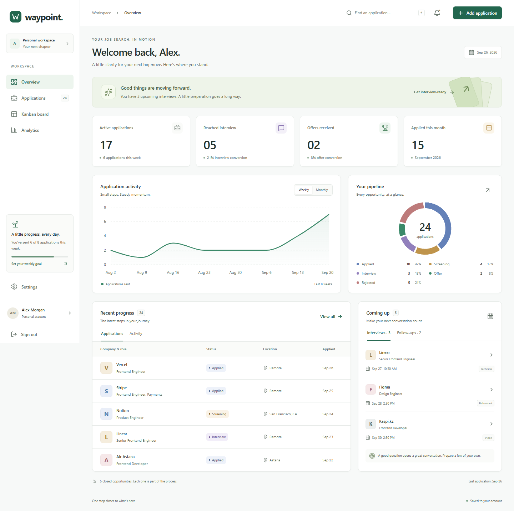

# Waypoint

A calm, full-stack workspace for a job search: applications, conversations, people, and next steps in one place. The existing green/off-white interface is preserved, with real accounts and a persistent relational database.



## Run locally

Requires **Node.js 24.14+** and npm. No Docker, cloud account, or paid service is required.

```sh
npm install
npm run dev
```

Open **http://127.0.0.1:5173**. The same command starts Vite and the API at port 3001. The database is created and migrated automatically at `data/waypoint.sqlite`.

Create an account on the sign-up page. New accounts start empty. **Settings → Reset demo** loads 24 realistic sample opportunities for your account after confirmation. The examples include remote/local companies, stages, interview outcomes, contacts, tags, and follow-ups.

In Windows PowerShell where script execution is disabled, use **`npm.cmd`** instead of `npm`.

### Configuration

Defaults work without a `.env` file. Copy `.env.example` to `.env` only when customizing:

| Variable | Default | Purpose |
| --- | --- | --- |
| `PORT` | `3001` | API port |
| `APP_ORIGIN` | `http://127.0.0.1:5173` in development | Exact browser origin allowed to make changes |
| `DATABASE_PATH` | `./data/waypoint.sqlite` | Persistent SQLite database |
| `SESSION_DAYS` | `7` | Absolute session lifetime, 1–30 days |
| `COOKIE_SECURE` | `false` | Set true only when serving through HTTPS |
| `DEMO_EMAIL`, `DEMO_PASSWORD` | No automatic account | Optional CLI seed account, password at least 12 characters |

Use the exact hostname shown above: `localhost` and `127.0.0.1` are different origins. After changing API ports, restart the development command so its proxy picks up the change. The development launcher reads `.env` before starting the API and Vite.

### Production build, served locally

```sh
npm run build
npm start
```

Open **http://127.0.0.1:3001**. Express serves both the compiled frontend and API, including deep links. Without an explicit `APP_ORIGIN`, production uses the API origin. If your `.env` contains the development origin, change it to `http://127.0.0.1:3001` for this command.

`npm run preview` is a frontend preview only and needs a separately running API. The supported full-stack production check is `npm start`.

Nothing is deployed by these commands.

## What it does

- **Accounts:** sign up, sign in/out, persistent server sessions, profile, weekly goal, light/dark/system themes. Each account has its own applications and related records.
- **Overview:** active pipeline, actual conversion metrics, activity over time, recent applications/activity, upcoming individual interviews and follow-ups.
- **Applications:** validated CRUD, notes, tags, work arrangement, salary, recruiter and interview shortcuts, searchable details, URL-based combined filters, sorting and table pagination.
- **Timeline:** status changes, contact updates, interview scheduling/outcomes/removal, and follow-up scheduling/completion recorded alongside each opportunity.
- **Kanban:** immediate optimistic moves, database persistence, version conflicts, failure rollback, and keyboard-friendly status menus.
- **Interviews:** multiple conversations per application with date/time, type, interviewer, meeting URL, notes, and outcome.
- **Contacts:** reusable recruiters or teammates, shared across applications; edit once or unlink from an individual opportunity.
- **Follow-ups and reminders:** lightweight dates and completion; due follow-ups and near-term interviews produce persistent read/unread notifications while using the app.
- **Analytics:** real application activity, status distribution, interview/offer conversion, rejection rate, location and employment breakdowns.
- **Data management:** JSON export/import, explicit browser-data migration, seed reset and clear actions, validation and atomic replacement.

## Architecture

**React 19 + TypeScript + Vite**, React Router, Zustand, React Hook Form, shared Zod schemas, Tailwind/CSS variables, Lucide, Recharts and dnd-kit. **Express + Node SQLite** provide the API, authentication and relational persistence.

```text
src/
  pages/          Lazy-loaded product and authentication screens
  components/     Forms, interview/contact/follow-up panels, shared UI
  layouts/        Persistent navigation and responsive application shell
  charts/         Real-data activity and status visualizations
  state/          Authenticated workspace cache and transient UI state
  types/          Shared domain types
  validation/     Shared form/API/import schemas
  utils/          API client, filters, metrics, dates and serialization
  data/           Realistic, relative-date demo records
server/
  app.ts          Routes, validation, origin checks and error handling
  auth.ts         Password hashing, sessions and auth rate limits
  repository.ts   User-scoped queries and transactional domain operations
  database.ts     SQLite setup and migration runner
  migrations/     Versioned relational schema
tests/            Browser workflows, failures, responsive and axe checks
docs/             Architecture, security boundaries and verification notes
```

The database has users, sessions, applications, tags, interviews, contacts, timeline events, reminders and relation tables, with foreign keys, ownership constraints and indexes. Browser localStorage is no longer authoritative.

Read [architecture and security boundaries](docs/ARCHITECTURE.md) for ownership, concurrency, import semantics and tradeoffs.

## Migrations and optional CLI seed

```sh
npm run db:migrate
npm run db:seed
```

Migrations run automatically on API startup and are safe to repeat. The seed command requires `DEMO_EMAIL` and `DEMO_PASSWORD` in your environment or ignored `.env`. It creates an account, or verifies its existing password, and only seeds an empty workspace. It will not overwrite existing applications. No shared demo password is committed.

## Backups and the earlier browser version

Settings exports version 2 JSON with applications, tags, linked contacts, interviews, follow-ups and timeline history. Imports accept v1 legacy exports, v2 exports, or an application array. The entire file is validated before a confirmed replacement, then the server replaces only the current user's data inside a transaction. Malformed input or inconsistent shared contacts leave existing data unchanged. Imported IDs are regenerated and shared contact links remapped.

Earlier `waypoint.workspace.v1` browser data is never silently associated with a new account. If that data exists, Settings offers **Import browser data**. It stays untouched in localStorage even after import.

For a full installation backup, stop the API and back up the database file and any SQLite sidecar files together; restore them while the API is stopped. Application JSON exports do not contain accounts, passwords, sessions, unlinked contacts, or notification read state.

## Verification

```sh
npm run typecheck
npm run lint
npm test
npx playwright install chromium
npm run test:e2e
npm run test:production
```

To use installed Microsoft Edge on Windows:

```powershell
$env:PLAYWRIGHT_CHANNEL = 'msedge'
npm.cmd run test:e2e
npm.cmd run test:production
```

API tests use a temporary database and real HTTP requests. Playwright starts isolated test services at **5187 / 3017** and creates a separate database under ignored `data/`. Each test gets its own account; your normal database is untouched. Test output and traces go to `test-results/` and `playwright-report/`. The production smoke test uses a temporary database and port **5190**, verifies the built UI and deep links, then restarts the server to check persisted applications and sessions.

See [verification notes](docs/VERIFICATION.md) for coverage and the final checked environment.

## Deliberate limits

This is a complete local full-stack product, not a hosted service. SQLite is stored on the machine running the API; there is no managed cloud backup. Node 24's SQLite API emits an experimental warning.

There is no email verification, password-reset email, MFA, background email/push delivery, file upload, or job-board scraping. Reminders appear while the application is open. Sign-in email is read-only; name, career focus, weekly goal and preferences are editable.

The workspace uses bounded client-side lists and polling, not real-time collaboration or server-side pagination. Imports are limited to 5 MB and 10,000 applications. Calendar follow-up due dates use the server's local day. Browser automation covers Chromium/Edge; other engines and assistive technologies need additional verification before a public release.
