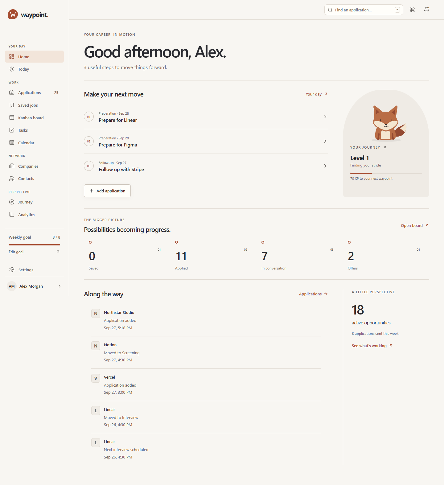
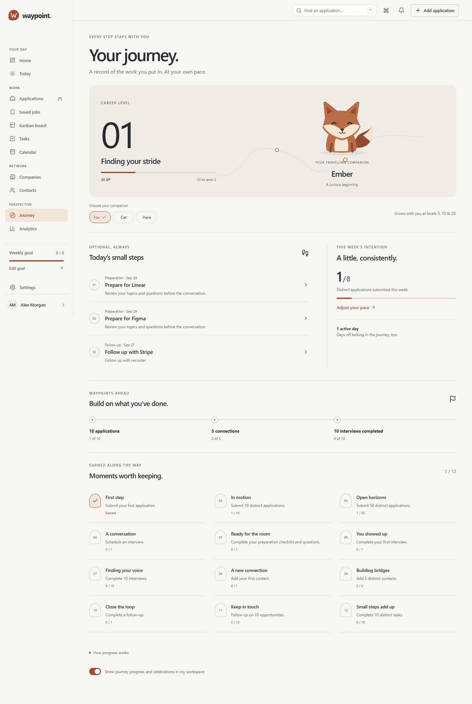
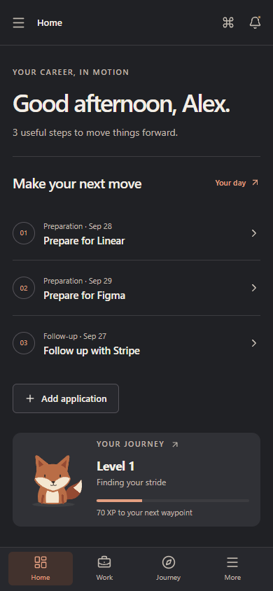

# Waypoint

A personal career journey: save opportunities, manage applications, prepare for interviews, and see your next useful step. Waypoint combines a warm paper-and-clay visual identity with real accounts and a persistent relational database.

Home puts priorities before statistics. Journey makes meaningful progress visible with optional companions, levels and achievements. The core career tools work independently of this layer.

## Current design

Home brings the next useful steps, career progress and pipeline into one calm view.



Journey shows the companion, level, contextual steps, milestones and achievements.



The same experience adapts to mobile and dark mode.



## Run locally

Requires **Node.js 24.14+** and npm. No Docker, cloud account, or paid service is required.

```sh
npm ci
npm run dev
```

Open **http://127.0.0.1:5173**. The same command starts Vite and the API at port 3001. The database is created and migrated automatically at `data/waypoint.sqlite`.

Create an account on the sign-up page. New accounts start empty. **Settings → Reset demo** loads 24 realistic sample opportunities for your account after confirmation. The examples include remote/local companies, stages, interview outcomes, contacts, tags, and follow-ups.

In Windows PowerShell where script execution is disabled, use **`npm.cmd`** instead of `npm`.

### Configuration

Defaults work without a `.env` file. Copy `.env.example` to `.env` only when customizing:

| Variable | Default | Purpose |
| --- | --- | --- |
| `PORT` | `3001` | API port |
| `APP_ORIGIN` | `http://127.0.0.1:5173` in development | Exact browser origin allowed to make changes |
| `DATABASE_PATH` | `./data/waypoint.sqlite` | Persistent SQLite database |
| `SESSION_DAYS` | `7` | Absolute session lifetime, 1–30 days |
| `COOKIE_SECURE` | `false` | Set true only when serving through HTTPS |
| `DEMO_EMAIL`, `DEMO_PASSWORD` | No automatic account | Optional CLI seed account, password at least 12 characters |

Use the exact hostname shown above: `localhost` and `127.0.0.1` are different origins. After changing API ports, restart the development command so its proxy picks up the change. The development launcher reads `.env` before starting the API and Vite.

For separate terminals, run `npm run dev:api` for Express and `npx vite --host 127.0.0.1 --port 5173 --strictPort` for the frontend. Prefer `npm run dev` when changing environment variables, since it loads `.env` for both processes.

### Production build, served locally

```sh
npm run build
npm start
```

Open **http://127.0.0.1:3001**. Express serves both the compiled frontend and API, including deep links. Without an explicit `APP_ORIGIN`, production uses the API origin. If your `.env` contains the development origin, change it to `http://127.0.0.1:3001` for this command.

`npm run preview` is a frontend preview only and needs a separately running API. The supported full-stack production check is `npm start`.

Nothing is deployed by these commands.

## What it does

- **Home and navigation:** personal briefing, next moves, compact pipeline route and recent activity; grouped desktop navigation and mobile Home/Work/Journey/More controls.
- **Journey:** server-owned XP, growing levels, three companions evolving at levels 5/10/20, contextual steps, weekly intentions, gentle activity rhythm and 12 achievements. Hide workspace progress through the Journey preference. See [rules and limitations](docs/GAMIFICATION.md).
- **Opportunities:** responsive rich lists showing next action and last activity, preserving search/filter/sort/bulk operations. Details surface next action before facts; Kanban retains drag and keyboard status controls.

- **Accounts:** sign up, sign in/out, persistent server sessions, profile, weekly goal, light/dark/system themes. Each account has its own applications and related records.
- **Today and calendar:** one agenda for task deadlines, interviews, follow-ups and application deadlines; overdue items, a 90-day upcoming view, month/day navigation and browser-timezone interview dates. Recent activity and recently opened records provide context.
- **Companies:** reusable research and links to related applications, contacts and interview history. Company names are shared within an account.
- **Tasks:** personal or application tasks, three priorities, completion/reopening and contextual checklists.
- **Application workspace:** separate conversation notes, saved job description, manually edited skills, resume version/URL, cover letter and portfolio/assignment links.
- **Interview preparation:** topics checklist, questions to ask, expected questions and personal post-interview reflections.
- **Analytics:** conversion rates, response timing, application activity, pipeline counts and source/location breakdowns. Charts stay off Home.
- **Applications:** validated CRUD, notes, tags, work arrangement, salary, recruiter and interview shortcuts, searchable details, URL-based combined filters, sorting and pagination.
- **Saved jobs:** keep promising roles with a link, source, salary, deadline and notes; convert to an application with one action and no re-entry.
- **Archive and bulk work:** select applications for status or tag changes, archive/restore, or confirmed deletion. Archived records remain searchable in the Archive view and out of the active board and reminders.
- **Timeline:** status changes, contact updates, interview scheduling/outcomes/removal, and follow-up scheduling/completion recorded alongside each opportunity.
- **Kanban:** immediate optimistic moves, database persistence, version conflicts, failure rollback, and keyboard-friendly status menus.
- **Interviews:** multiple conversations per application with date/time, type, round, interviewer, location, meeting URL, notes, and outcome.
- **Contacts:** reusable recruiters or teammates, shared across applications; edit once or unlink from an individual opportunity.
- **Follow-ups and reminders:** dates, reasons, notes, and completion; due follow-ups and near-term interviews produce persistent read/unread notifications while using the app.
- **Analytics:** real application activity, status distribution, interview/offer conversion, rejection rate, source breakdown, and first recorded response timing. Records without a status response are excluded from that timing metric.
- **Global search:** grouped application, company, contact, task, note and saved-job results inside the existing command palette.
- **Commands:** Ctrl/⌘ K opens the searchable command palette; N opens a new application and / focuses search outside text fields and dialogs.
- **Data management:** JSON export/import, explicit browser-data migration, seed reset and clear actions, validation and atomic replacement.

## Architecture

**React 19 + TypeScript + Vite**, React Router, Zustand, React Hook Form, shared Zod schemas, Tailwind/CSS variables, Lucide, Recharts and dnd-kit. **Express + Node SQLite** provide the API, authentication and relational persistence.

```text
src/
  pages/          Lazy-loaded product and authentication screens
  components/     Forms, interview/contact/follow-up panels, shared UI
  layouts/        Persistent navigation and responsive application shell
  charts/         Real-data activity and status visualizations
  state/          Authenticated workspace cache and transient UI state
  domain/         Career schemas and compact reporting contracts
  hooks/          Abortable, account-scoped resource loading
  types/          Shared domain types
  validation/     Shared form/API/import schemas
  utils/          API client, filters, metrics, dates and serialization
  data/           Realistic, relative-date demo records
server/
  app.ts          Routes, validation, origin checks and error handling
  auth.ts         Password hashing, sessions and auth rate limits
  repository.ts   User-scoped queries and transactional domain operations
  careerRepository.ts  Companies, tasks, notes, materials and preparation
  collections.ts  Server pagination and compact analytics
  careerBackup.ts Complete career export and transactional link remapping
  database.ts     SQLite setup and migration runner
  migrations/     Versioned relational schema
tests/            Browser workflows, failures, responsive and axe checks
docs/             Architecture, security boundaries and verification notes
```

The database has users, sessions, applications, saved jobs, companies, tasks, notes, materials, interview preparation, tags, interviews, contacts, timeline events, reminders and relation tables, with foreign keys, ownership constraints and indexes. Browser localStorage is no longer authoritative.

Read [architecture and security boundaries](docs/ARCHITECTURE.md) for ownership, concurrency, import semantics and tradeoffs.

### API overview

All routes are under `/api`. The browser uses a same-origin, HttpOnly session cookie. Mutations require `Content-Type: application/json` and an `Origin` matching `APP_ORIGIN`. Application writes send the current `version`; stale edits return 409 and can be reviewed and retried.

| Routes | Purpose |
| --- | --- |
| `POST /auth/signup`, `/auth/login`, `/auth/logout`; `GET /auth/session` | Account and session lifecycle |
| `GET /workspace` | Profile and bounded initial cache: 50 applications, 200 saved jobs, 200 contacts and 50 reminders |
| `GET /applications`, `/saved-jobs/page`, `/contacts`, `/notifications`, `/applications/:id/activity` | Owner-scoped paginated collections |
| `GET /overview`, `/schedule`, `/suggestions`, `/search` | Compact analytics, unified agenda, contextual follow-up suggestions and grouped search |
| `GET`, `POST /companies`; `GET`, `PUT /companies/:id` | Company research and relationship view |
| `GET`, `POST /tasks`; `GET`, `PUT`, `DELETE /tasks/:id` | Versioned personal/application tasks |
| `GET`, `POST /applications/:id/notes`; `PUT`, `DELETE /applications/:id/notes/:noteId` | Individual conversation and outcome notes |
| `GET`, `PUT /applications/:id/materials`, `/interviews/:id/preparation` | Materials and interview preparation |
| `GET /workspace/export` | Complete version 4 career backup independent of the browser cache |
| `GET`, `POST /saved-jobs`; `PUT`, `DELETE /saved-jobs/:id`; `POST /saved-jobs/:id/apply` | Saved job lifecycle and atomic conversion |
| `POST /applications`; `GET`, `PUT`, `DELETE /applications/:id` | Application CRUD, including notes and tags |
| `POST /applications/bulk` | Atomic, version-checked status, tag, archive, restore or delete actions |
| `PATCH /applications/:id/status`, `/applications/:id/follow-up` | Workflow and follow-up updates |
| `POST /applications/:id/interviews`; `PUT`, `DELETE /applications/:id/interviews/:interviewId` | Interview scheduling and outcomes |
| `POST /applications/:id/contacts`; `DELETE /applications/:id/contacts/:contactId`; `PUT /contacts/:id` | Shared contacts and application links |
| `PATCH /profile` | Name, career focus, weekly goal and preferences |
| `POST /notifications/:id/read`, `/notifications/read-all` | Reminder read state |
| `POST /workspace/import`, `/workspace/demo`, `/workspace/clear` | Explicit replacement of the current user's workspace |
| `GET /health` | API/database health |

Errors use `{ "error": "Actionable message" }`: 401 for a missing/expired session, 403 for an unrecognized origin, 404 for missing or foreign-owned records, 409 for conflicts, 422 for invalid input, 429 for authentication throttling, and 503 for unavailable storage. No client-provided owner ID controls access.

## Migrations and optional CLI seed

```sh
npm run db:migrate
npm run db:seed
```

Migrations run automatically on API startup and are safe to repeat. The seed command requires `DEMO_EMAIL` and `DEMO_PASSWORD` in your environment or ignored `.env`. It creates an account, or verifies its existing password, and only seeds an empty workspace. It will not overwrite existing applications. No shared demo password is committed.

## Backups and the earlier browser version

Settings exports version 4 JSON directly from the authenticated API, including all applications and saved jobs, reusable companies and contacts (including unlinked people), tasks, notes, materials, interview preparation and retained timelines. Imports accept v1/v2/v3/v4 exports or a legacy application array. The server validates and restores all relationships in one transaction, regenerating IDs. Foreign/missing relationship references and inconsistent shared contacts roll back the complete replacement.

A v4 import replaces career entities as well as applications and saved jobs. Older imports cannot restore new career data: linked tasks, notes, materials and preparation are removed with the old applications; personal tasks and company research remain. Clear/demo reset use the same application deletion semantics and retain saved jobs. Archive keeps all related data and can be restored. Completing a task keeps it in the Completed list and supports reopening. Deleting an application permanently removes its linked career records; deleting a note or task is permanent. Export before replacement or permanent deletion.

Earlier `waypoint.workspace.v1` browser data is never silently associated with a new account. If that data exists, Settings offers **Import browser data**. It stays untouched in localStorage even after import.

For a full installation backup, stop the API and back up the database file and any SQLite sidecar files together; restore them while the API is stopped. Application JSON exports do not contain accounts, passwords, sessions, profile preferences or notification read state.

## Verification

```sh
npm run typecheck
npm run lint
npm test
npx playwright install chromium
npm run test:e2e
npm run test:production
```

To use installed Microsoft Edge on Windows:

```powershell
$env:PLAYWRIGHT_CHANNEL = 'msedge'
npm.cmd run test:e2e
npm.cmd run test:production
```

API tests use a temporary database and real HTTP requests. Playwright starts isolated test services at **5187 / 3017** and creates a separate database under ignored `data/`. Each test gets its own account; your normal database is untouched. Test output and traces go to `test-results/` and `playwright-report/`. The production smoke test uses a temporary database and port **5190**, verifies the built UI and deep links, then restarts the server to check persisted applications, career records, sessions, XP and companion choice.

See [verification notes](docs/VERIFICATION.md) for coverage and the final checked environment.

### Scripts

| Command | Purpose |
| --- | --- |
| `npm run dev` | Start API and Vite together |
| `npm run dev:api` | Watch the API source |
| `npm run db:migrate` / `npm run db:seed` | Initialize schema / seed an explicitly configured development account |
| `npm run typecheck` / `npm run lint` | TypeScript / ESLint checks |
| `npm test` | HTTP/database, domain and state recovery tests |
| `npm run test:e2e` | Isolated browser workflows, responsive and accessibility checks |
| `npm run build` | Typecheck and compile the frontend |
| `npm start` | Serve the built frontend and API locally |
| `npm run preview` | Preview the frontend with a separately running default-port API |
| `npm run test:production` | Build and verify browser behavior and persistence across an API restart |

Only root `/data/` is ignored: it holds local databases. `src/data/demo.ts` is versioned source required by the optional demo/seed endpoints and tests. New accounts never load sample data automatically.

## Deliberate limits

This is a complete local full-stack product, not a hosted service. SQLite is stored on the machine running the API; there is no managed cloud backup. Node 24's SQLite API emits an experimental warning.

There is no email verification, password-reset email, MFA, background email/push delivery, file upload, or job-board scraping. Reminders appear while the application is open. Sign-in email is read-only; name, career focus, weekly goal and preferences are editable.

Collections use server pagination, compact aggregate responses and bounded bootstrap data. Window focus/60-second polling refreshes active queries; there is no real-time collaboration. Imports are limited to 5 MB and 10,000 applications. Full exports can exceed the import limit; use a stopped-database backup for a larger installation. Reports and reminder generation use the API host's local day; Today/calendar interview grouping uses the browser timezone. Company profiles show up to 50 contacts and the 20 most recent interviews; the Contacts directory and application details provide the full context. Task application pickers use the recent cache; open an application to add tasks to an older opportunity. Recently opened items last only for the current signed-in browser session. Browser automation covers Chromium/Edge; other engines and assistive technologies need additional verification before a public release.
