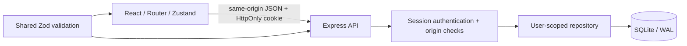

# Architecture and data ownership

## Journey experience

Migration `004_journey.sql` adds preferences, reward rules, an owner-scoped event ledger and achievement unlocks. Domain triggers and one reward-candidate entry point keep awards in the original application/task/interview/contact/follow-up transaction. The client cannot grant XP. Existing meaningful records receive a marked one-time backfill; import/demo operations suppress credit while retaining anti-duplication evidence. Reads do not mutate progress. See [GAMIFICATION.md](GAMIFICATION.md) for rules and backup boundaries.

Migration `005_journey_trigger_integrity.sql` upgrades early local Journey databases to explicit conflict handling in the reward/achievement triggers without replaying events. Fresh installations apply both migrations; domain transactions and existing progress are preserved.

`server/journey.ts` returns one aggregate with levels, companion, bounded history, achievements, contextual steps and weekly/activity rhythm. AppLayout owns one progress resource and one Overview resource, shared through contexts. Original inline SVG companions and CSS tokens add no asset requests or animation dependencies. Screens remain lazy routes. Home is the primary route; Today remains the detailed agenda. Applications render rich lists with next tasks from a grouped repository query. Native dialogs, conflict recovery, filtering, bulk actions and imports remain in place. The [design diagnosis](JOURNEY_DESIGN.md) records the preimplementation browser review.

Waypoint keeps its existing React interface and adds a same-origin TypeScript API. React Router loads screens on demand; Zustand holds the authenticated workspace cache and transient saving/error state. React Hook Form and shared Zod schemas validate forms. Express validates every write again before the repository touches SQLite.

SQLite was selected for a reproducible local setup with no service account, Docker daemon, or paid infrastructure. It is a real relational database file, independent of browser storage. Node's built-in `node:sqlite` removes a native addon build step. This version targets Node 24.14 or newer; that runtime emits an experimental SQLite warning. The API can later be moved to PostgreSQL behind the repository boundary. There is no claim of managed cloud synchronization.

## Relational model

`server/migrations/001_initial.sql`, `002_job_search_workflow.sql`, `003_career_crm.sql`, `004_journey.sql` and `005_journey_trigger_integrity.sql` are the schema sources. Migrations are tracked in the `migrations` table and applied atomically on startup; `npm run db:migrate` also runs them explicitly. Migration 002 adds new columns with safe defaults, retaining existing application and interview rows. Migration 003 backfills reusable companies per owner and preserves all retained timeline rows while expanding supported event types.

| Table | Purpose and relationships |
| --- | --- |
| `users` | Unique case-insensitive email, password hash, profile and preferences |
| `sessions` | Hashed opaque token, user foreign key, absolute expiry |
| `applications` | User-owned opportunity, status, work arrangement, follow-up and revision |
| `saved_jobs` | User-owned opportunities not yet applied to; versioned and converted in one transaction |
| `tags` / `application_tags` | Per-user tag vocabulary and application links |
| `contacts` / `application_contacts` | Reusable user-owned contacts and links |
| `interviews` | Many dated conversations per application with type, URL, notes and outcome |
| `timeline_events` | Meaningful application events, including contact and interview changes |
| `notifications` | Persistent read state for currently relevant reminders |
| `companies` / `application_companies` | Reusable company research and application membership, unique per account/name |
| `tasks` | Account tasks with optional application FK, priority, completion and version |
| `application_notes` | Multiple versioned conversation/outcome notes per application |
| `application_materials` | One structured text/link record per application |
| `interview_preparations` | Checklist, questions and subjective reflection for one interview |
| `rate_limits` | Expiring sign-in attempt counters |

Composite foreign keys include `userId` for application/contact relations. A cross-owner link fails even if an API check is accidentally omitted. Deleting an application cascades through its links, interviews, preparation, notes, materials, linked tasks, timeline and reminders; reusable contacts, companies and personal tasks remain available. Data replacement clears only that user's records. Queries bind values through prepared statements. The repository groups relation rows in memory after a small fixed set of indexed queries instead of issuing a query for every row.

## Writes and concurrency

- Application writes check the submitted version. A stale version returns **409** and the client refreshes current server data while retaining the open draft. Saving again is an explicit retry. Shared contacts have their own versions; edits update all linked applications and their timelines.
- A Kanban move changes the cache immediately, then persists the status and timeline together. A failed request restores the previous record and displays the API error. A successful save is never undone just because a subsequent reminder refresh failed; refresh errors remain visible with a retry action. A 401 during either post-save refresh or conflict recovery clears private state immediately.
- Mutation controls are serialized in the workspace store. Background refreshes are skipped while saving. An epoch guard prevents an old request from restoring private data after logout or account changes.
- The authenticated workspace refreshes on window focus and every 60 seconds while visible. This is lightweight polling, not real-time collaboration.
- Import validates the entire input on both sides, then replaces records in one transaction. New IDs are assigned to imported entities; shared contact references are remapped consistently. Conflicting versions of the same contact cause a rollback. All prior data remains intact on validation or transaction failure.
- Bulk actions validate every selected application and version before any change; an invalid or foreign-owned ID rolls the entire action back. Archiving keeps the application and timeline, while the active board and reminder generator omit it.
- Version 4 backups come from a dedicated export endpoint and include all career entities and unlinked contacts. Earlier formats remain readable. IDs and company/application/interview relationships are remapped in the same transaction; invalid references fail before commit. Clear/demo reset cascade through application-owned entities, retaining saved jobs, companies and personal tasks.

## Authentication and security boundaries

- Passwords use asynchronous scrypt (`N=131072`, `r=8`, `p=1`) with independent random salts. Concurrent hashing is bounded to control memory use. Passwords and hashes never enter frontend responses.
- Session cookies contain 256-bit random tokens; only their SHA-256 digests are stored. Cookies are HttpOnly and SameSite=Strict, with absolute expiration. Sign-in rotates the session and logout revokes it. Secure mode uses a `__Host-` cookie.
- All mutations require the exact configured Origin and JSON content type. No permissive CORS configuration exists. Authentication endpoints also use IP and normalized-email rate limits.
- Every protected route obtains the owner from the session. IDs provided by the browser never select the acting user. Missing and foreign-owned records both return 404.
- Shared schemas constrain field sizes, statuses, calendar dates, URLs, imports, and record counts. Links allow only HTTP(S); React renders user strings as text. Meeting URLs are never fetched by the backend.
- Production responses set CSP, frame restrictions, content sniffing protection and referrer/permission policies. API responses are `no-store`. HTTPS mode adds HSTS and Secure cookies. `.env` files, database files, logs, and test output are excluded from Git.

Implementation references: [Node SQLite](https://nodejs.org/download/release/latest-jod/docs/api/sqlite.html), [Express security practices](https://expressjs.com/en/advanced/best-practice-security.html). Deployment would still require HTTPS, backup operations, monitoring, and a review appropriate to the hosting environment. Nothing is deployed by this repository's scripts.

## Product semantics

- Application/follow-up dates are calendar dates. Event and interview timestamps are ISO UTC and displayed in the browser's timezone. Due follow-ups use the server's current calendar date, matching the local installation's clock.
- Salary is annual USD, with no currency conversion implied.
- Conversion counts opportunities with a non-cancelled interview, a retained completed-interview event, or an interview/offer stage in their recorded history; offers imply an interview. Deleting a completed interview does not erase its historical conversion while its event is retained. Rejection rate describes current rejected status, while active excludes offers and rejections. Empty workspaces show no conversion percentage. Weekly goals count Monday through today in the API host's local calendar; monthly progress excludes future dates.
- The saved count is the current wishlist, not a historical conversion denominator. First recorded response timing uses the first non-applied status event on or after the application date; records without such an event are excluded and no average is shown when none qualify. Source percentages use all applications, including archived historical records.
- Upcoming interviews are individual scheduled conversations, including multiple interviews for the same application. Outcomes, cancellations, and deletion remove irrelevant reminders.
- Interview reminders cover the next 48 hours (and one hour after the start); follow-ups include due/overdue incomplete dates. Reminders are generated on workspace reads and retain read state while relevant. They are in-app reminders, not emails or push notifications.
- Timeline retention is the latest 1,000 events per application. The workspace supports up to 10,000 applications, 100 interviews and 30 linked contacts per application, with imports capped at 5 MB. The application table and board columns paginate through SQL; large-scale multi-tenant loading remains outside this local product's scope.
- Legacy recruiter and interview fields are compatibility aliases for normalized relations. Original localStorage data is read only when the user explicitly chooses its import action in Settings and is never overwritten by the current app.

## Career data flow and bounds

The existing application types/validation remain authoritative for status, work mode, interview types and legacy fields. New schemas live in `src/domain/career.ts`; API input, response parsing and forms reuse them. `careerRoutes.ts` handles validation, `careerRepository.ts` owns related operations, `collections.ts` owns filtered list/report projections, and `careerBackup.ts` owns complete export/restore. `activity.ts` centralizes retention and meaningful event writes.

Bootstrap returns at most 50 applications with 20 recent events each, 200 saved jobs, 200 contacts and 50 reminders. The mutable browser application cache is capped at 200 on contextual reads. Application lists use pages of 10, Kanban columns 20, contacts/companies/tasks/saved jobs default 20, activity/notes 20, notifications 50, schedule 100; supported configurable sizes never exceed 100. Global search returns at most 8 results per group. Company relationship previews cap contacts at 50 and interviews at 20. Filters, aggregate counts and JSON export query the whole authenticated dataset independently of the cache.

`useResource` combines account identity and request path, aborts obsolete requests, ignores responses from a previous account and refreshes active queries after successful writes. `useMutation` retains form errors and blocks repeated submissions while saving. New task/note creates additionally accept stable request UUIDs for retries. Existing application mutations remain serialized by Zustand; API versions handle cross-window conflicts. A record write updates its cache entry and fetches reminders, rather than rehydrating all applications. Small widget boundaries isolate chart rendering failures.

Overview analytics use compact application facts plus indexed history predicates. They reuse the original conversion semantics and return aggregate series, bounded breakdowns and five recent events. Analytics and schedule still perform proportional work on the local server; no scalability claim is made for enterprise-sized corpora. Filter option vocabularies show the first 200 values; URL filters and text search remain available for other values.

Today and Calendar share `/schedule`. Calendar has a 42-cell Monday-first month grid and a paginated selected-day list, not a third-party calendar library. Interview instants are grouped using the browser's IANA timezone. Date-only tasks/deadlines remain calendar dates. Completed tasks, completed follow-ups and archived application schedules do not appear as open work. The screening suggestion is a transparent seven-day rule and never sends a message.

Recently opened records are held only in memory, bounded to six, and cleared at logout/session expiry. Archive/restore remains the recovery mechanism for applications. Permanent delete has no undo; completed tasks can be reopened. There is no offline write queue, PWA, file storage, automatic skill extraction or external messaging integration.

## Tests

Domain and state recovery checks use Vitest. API tests use real authenticated HTTP calls and a temporary SQLite database; they exercise owner isolation, conflict checks, backup remapping/rollback, date projection and collections beyond bootstrap size. The migration test starts with an older database and checks preserved application/interview/activity rows, backfilled company ownership, indexes and foreign-key integrity. Playwright runs separate local services/accounts for full workflows, direct foreign-ID navigation, keyboard interactions, responsive bounds and axe checks. The production smoke tests compiled assets and persistence across an API restart.

See [the audit](CAREER_CRM_AUDIT.md), [decision record](adr/001-career-workspace.md) and [verification log](VERIFICATION.md).
